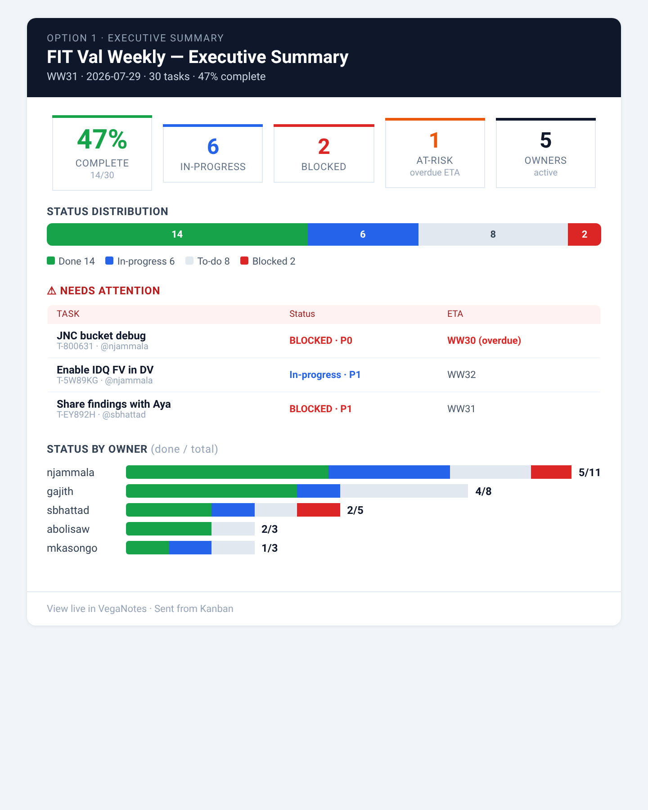
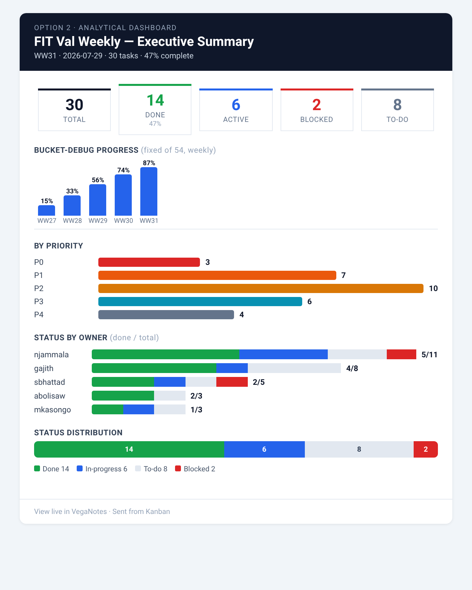
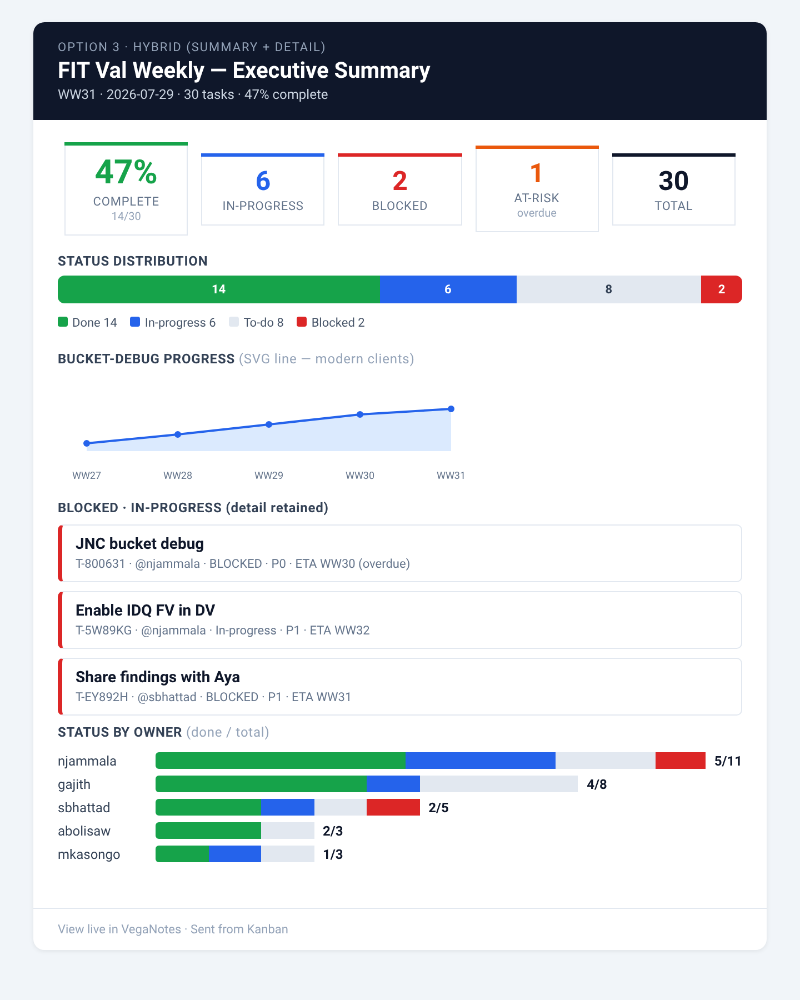

# Kanban "Send Email" — executive-summary redesign options

Design mockups for redesigning the Kanban **Send Email** output from a task
"list dump" into an **executive summary** with charts, tables, and KPIs.

These are **static mockups** rendered at ~680px (email column width). The data
is representative *FIT Val Weekly WW31* content, not live output.

> **Decision pending** — pick a direction before implementation. See the
> tracking issue for discussion and the recommendation.

## The hard constraint: how the email is actually sent

The Kanban email is **not sent via SMTP**. `KanbanEmailModal` builds an HTML
body and:

1. copies it to the clipboard as `text/html` (user pastes into Outlook / webmail), or
2. opens a `mailto:` link (plain-text fallback).

There is **no server, no image hosting, no attachments**. That dictates what
charts are possible:

| Chart technique | Outlook (Win) | Apple Mail / Gmail / webmail | Notes |
| --- | --- | --- | --- |
| **Table/CSS bars** (`<td bgcolor width="%">`) | ✅ robust | ✅ robust | Bar + column charts, stacked bars, progress. **Always works.** |
| **Inline SVG** (true line/area chart) | ⚠️ stripped/degraded | ✅ renders | Great line charts on modern clients; Outlook shows a fallback. |
| **Hosted ``** (PNG from a chart server) | ⚠️ blocked by default | ✅ | Needs image hosting + "download pictures" click. Not built. |
| **base64 / CID images** | ❌ stripped | ⚠️ mixed | Outlook drops data-URIs. Avoid. |

**Takeaway:** table/column charts are the safe universal path; a true *line*
chart requires inline SVG (Option 3), which degrades gracefully in Outlook.

## Options

### Option 1 — Executive Summary (leadership-first)


KPI tiles → status-distribution bar → **Needs Attention** table (blocked /
overdue) → status-by-owner stacked bars. Minimal detail, "at a glance."
All table/CSS — renders everywhere.

### Option 2 — Analytical Dashboard (chart-rich)


KPI tiles → **bucket-debug progress column chart** (weekly `#progress` trend) →
priority bar chart → owner stacked bars → status bar. The trend is a **column
chart** (table cells), so it survives Outlook. Best for a status meeting.

### Option 3 — Hybrid (summary + detail)


KPI tiles → status bar → **SVG line chart** for the weekly trend → retained
task-detail cards for blocked/in-progress → owner bars. Uses **inline SVG** for
a true line chart (crisp on modern clients, graceful fallback in Outlook).
Keeps some of the current per-task detail.

## Reproduce

```bash
cd VegaNotes/docs/email-redesign
python3 generate_mockups.py      # writes option{1,2,3}.html
# render to PNG with any headless browser (we used Playwright chromium)
```

## Implementation notes (once a direction is chosen)

- Redesign lives in `frontend/src/components/Kanban/emailFormat.ts`
  (`buildHtmlBody`), reusing existing helpers (`htmlOwnerStatusTable`,
  `htmlArProgress`, `STATUS_COLORS`, `PRIORITY_COLORS`).
- The weekly trend uses the `#progress N/D` history already exposed by
  `GET /api/tasks/{ref}/progress-history` (feature #320).
- Keep `tests/kanbanEmailFormat.test.ts` green; add chart-builder unit tests.
- Plain-text `buildPlainBody` stays as the `mailto:` fallback.
