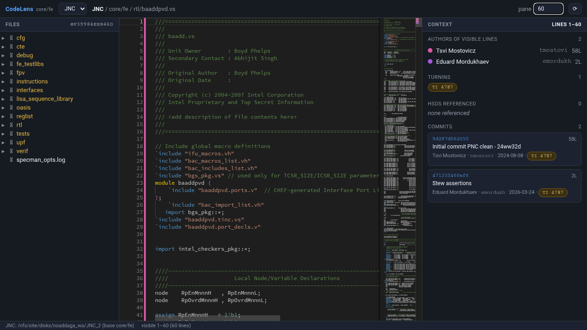

# CodeLens — an IDE-like code browser for `core/fe`

CodeLens is a lightweight, self-hosted web IDE for browsing the GFC / JNC
front-end RTL and test-bench sources with **living context**. You read code on
the left; the right pane continuously answers *"for the lines I'm looking at
right now — who changed them, under which turnin, and referencing which HSDs?"*

It is a single stdlib-only Python HTTP server plus one self-contained HTML page
(Monaco editor), in the same spirit as `tools/teamhub`.



## Quick start

```bash
bin/codelens                 # then open the printed http://localhost:8770
```

By default it auto-discovers the JNC and GFC repos the same way `setJNCfit` /
`setGFC` do. To point it at your own workareas (faster than the NFS symlinks):

```bash
JNC_REPO=/nfs/site/disks/<you>/JNC_2/core \
GFC_REPO=/nfs/site/disks/<you>/GFC_2/core \
bin/codelens
```

Switch between the configured repos with the selector in the top bar.

## What each pane shows

| Area | Contents |
|------|----------|
| **Left — file tree** | Lazy directory tree rooted at `core/fe`. Click a file to open it. |
| **Center — editor** | Monaco, read-only, SystemVerilog-aware highlighting. A colored bar in the line gutter encodes the last author of each line (matching the author dots on the right); hover a line for author · date · commit summary · sha. |
| **Right — three tabs** | The right pane has three views (keyboard `1`/`2`/`3`): <ul><li>**Context** *(1)* — the range-scoped view above.</li><li>**TI Scope** *(2)* — every turnin that ever touched this file, with #commits touching this file, +/−, authors, merge date and subject. Sortable, filterable, click a TI pill to drill into the TI lens.</li><li>**Commit Scope** *(3)* — every commit that ever touched this file (rename history followed), with introducing TI(s), per-file +/−, author, subject. Sortable, filterable, click a sha to open the commit lens.</li></ul> The TI Scope list is **derived** from the Commit Scope list — the TI set is exactly the union of the per-commit `turnins`, guaranteeing round-trip consistency between the two views (no phantom TIs, no orphan commits). |

### Pane size (number of lines)

The `pane` box in the top bar controls how many lines the right pane
summarizes:

- `auto` (default) — use whatever is physically on screen.
- a number, e.g. `60` — summarize a fixed window of 60 lines anchored at the
  top of the viewport, regardless of zoom / window height.

The context and blame refresh automatically (debounced) as you scroll, and the
`⟳` button forces a cache-bypassing recompute.

### Drill-down lenses (TI & commit)

Turnins and commit shas everywhere in the right pane are **clickable**, opening
a focused overlay — modeled on the TeamHub turnin drill-down, but scoped to the
one thing you clicked:

- **TI lens** — for a `user_turnin<N>`: the introducing merge, status, the
  commits it brought in (SHA · subject · author · date), every file it changed
  with per-file `+add / −del` counts, contributing authors (with IDSIDs), and
  the HSDs it references.
- **Commit lens** — for a single sha: full author / IDSID / date, the complete
  commit message, the turnin and HSDs it maps to, and the list of files it
  changed with `+add / −del` counts.

The two lenses cross-link: click a commit inside a TI lens to dive into that
commit, click the commit's turnin to jump back up — a breadcrumb tracks the
trail. A file name jumps straight to that file in the editor (when it lives
under `core/fe`). `Esc` or a click on the backdrop closes the overlay. Both
lenses are derived live from git and cached immutably under `.cache/`.

## How the context is derived

Everything is computed live from the git repos — no database:

1. `git blame --line-porcelain -L <start>,<end>` over the visible range gives
   the owning commit, author, and time of every visible line.
2. Each distinct commit is enriched **once** (results cached forever under
   `.cache/`, since a sha's history is immutable):
   - HSD ids are parsed from the commit message (`\d{9,14}`),
   - the introducing merge is found via `git log --merges --ancestry-path
     <sha>..HEAD` and its `user_turnin<N>` id extracted.
3. Author display names ("Last, First") are normalized and resolved to IDSIDs
   via the email local-part, a small hint table, and the `phonebook` CLI,
   cached in `.idsid_cache.json` (same mechanism as `tools/teamhub`).

## Configuration (environment)

| Variable | Default | Meaning |
|----------|---------|---------|
| `CODELENS_PORT` | `8770` | HTTP port. |
| `JNC_REPO` | jnc-a0 fit `-latest` symlink | Path anywhere inside the JNC repo. |
| `GFC_REPO` | gfc-b0 `-latest` symlink | Path anywhere inside the GFC repo. |
| `CODELENS_REPO` | — | Extra/primary repo path; becomes the default when set. |
| `CODELENS_BASE` | auto (`core/fe`) | Sub-path within the repo to root the browser at. |
| `IDSID_CACHE` | `./.idsid_cache.json` | IDSID resolution cache location. |

The repo path may point anywhere inside a working tree; CodeLens resolves the
git toplevel and locates `core/fe` beneath it automatically.

## HTTP API

The UI is a thin client over these JSON endpoints (handy for scripting):

| Endpoint | Purpose |
|----------|---------|
| `GET /api/repos` | Configured repos, their resolved root/base/HEAD, and the default. |
| `GET /api/tree?repo=&path=` | One directory level under `core/fe`. |
| `GET /api/file?repo=&path=` | File content + language + line count. |
| `GET /api/blame?repo=&path=&start=&end=` | Per-line blame for a range. |
| `GET /api/context?repo=&path=&start=&end=[&force=1]` | Aggregated authors / turnins / HSDs / commits for a range. |
| `GET /api/file/tis?repo=&path=[&follow=0][&force=1]` | **TI Scope**: every turnin that ever touched the file — derived from the per-commit turnin list so `⋃ commit.turnins == TIScope` (round-trip). |
| `GET /api/file/commits?repo=&path=[&follow=0][&force=1]` | **Commit Scope**: every commit that ever touched the file (rename-following by default), each with introducing TI(s), per-file +/−, and merge context. |
| `GET /api/ti?repo=&id=<turnin>[&force=1]` | **TI lens**: introducing merge, commits, files-changed (+/−), HSDs, authors for one turnin. |
| `GET /api/commit?repo=&sha=<sha>[&force=1]` | **Commit lens**: full metadata + message, files-changed (+/−), turnin/HSD/merge for one commit. |
| `GET /api/health` | Liveness + repo status. |

Paths in the API are relative to `core/fe`; path traversal outside the base is
rejected.

## Scope & roadmap

This is the local-only MVP. Deferred, planned follow-ups:

- **HSD resolution** — turn referenced ids into title / status / owner (needs
  HSD-ES auth).
- **Spec linking** — map a module to its owning spec document.
- **AI code-review surfacing** — show PR / Copilot review comments inline
  (needs GitHub SSO for the restricted repo, or local `dt` integration).

## Requirements

Python 3.9+ (stdlib only), `git`, and `phonebook` on `PATH`. The browser
viewing the page needs outbound HTTPS to load Monaco from the CDN.
