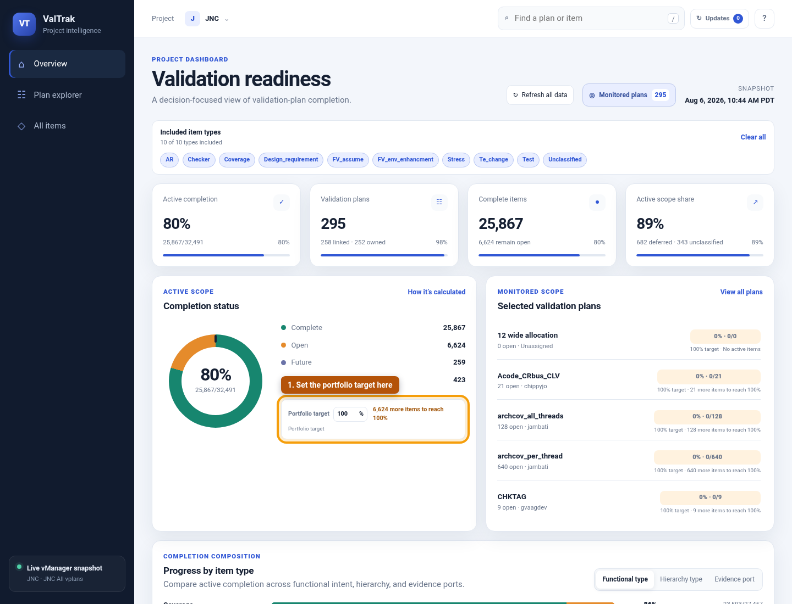
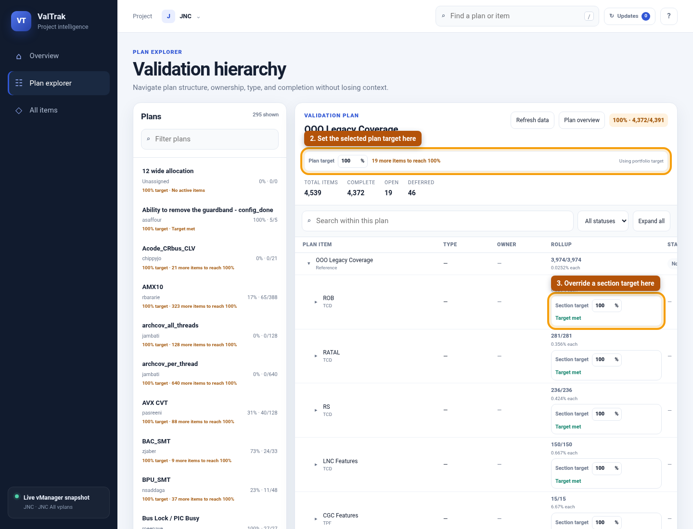

# ValTrak

ValTrak is a browser-based vManager validation-plan dashboard. It provides
project readiness metrics, monitored-plan scoping, hierarchy and item
exploration, per-plan dashboards, live data refreshes, and guarded background
status updates.

## Start

```bash
bin/valtrak
```

Open the tokenized **Access URL** printed at startup, then select
**Refresh all data** on first use. ValTrak retrieves the plan catalog and
aggregate hierarchy using your vManager token. Credentials are never sent to
the browser.

## Configuration

| Variable | Default | Purpose |
| --- | --- | --- |
| `VALTRAK_HOST` | `127.0.0.1` | HTTP bind address |
| `VALTRAK_PORT` | `8767` | HTTP port |
| `VALTRAK_VMGR_SERVER` | `scygrnit337.sc.intel.com:8090` | vManager server |
| `VALTRAK_PROJECT` | `jnc` | vManager project |
| `VALTRAK_ROOT_PLAN` | `JNC All vplans` | Aggregate plan used for the project dashboard |
| `VALTRAK_STATE_DIR` | `~/.valtrak` | Private snapshots, jobs, overrides, completion targets, and access token |

Example network launch:

```bash
setenv VALTRAK_HOST `hostname -i`
setenv VALTRAK_PORT 8767
bin/valtrak
```

ValTrak rejects requests without the `HttpOnly` session cookie established by
its tokenized access URL, including on loopback. Treat that URL as sensitive:
authorized users can submit vManager status updates through your account.

## Data and update safety

- Full and single-plan refreshes run in the background and atomically replace
  the active snapshot only after a complete vManager read.
- Completion is `complete / (complete + open)`; `future` and `rejected` are
  excluded.
- Completion targets persist in `completion-targets.json` and are shared by
  users of the service. Plans inherit the portfolio target, and sections
  inherit their plan target until an explicit override is set. The remaining
  gap is `max(0, ceil(target × active items) - complete items)`; scopes without
  active items report that directly.
- Status updates re-read the live item, enforce the expected current status,
  resolve referenced items to their native owning plan, write, and verify.
- Runtime files use owner-only permissions under `VALTRAK_STATE_DIR`.
- The bundled certificate pins the internal vManager certificate.

## Completion target controls

Set the shared portfolio target from the Overview completion panel:



Set a plan target from Plan Explorer and override inherited targets on
individual hierarchy sections:



## Requirements

- Python 3.9+
- `requests>=2.28`
- Access to Intel's `vmgr_get_token` helper under `vmgr_tools`
- A valid token for the configured vManager server

## Tests

```bash
python3 -m pytest tools/valtrak/tests -v
```
